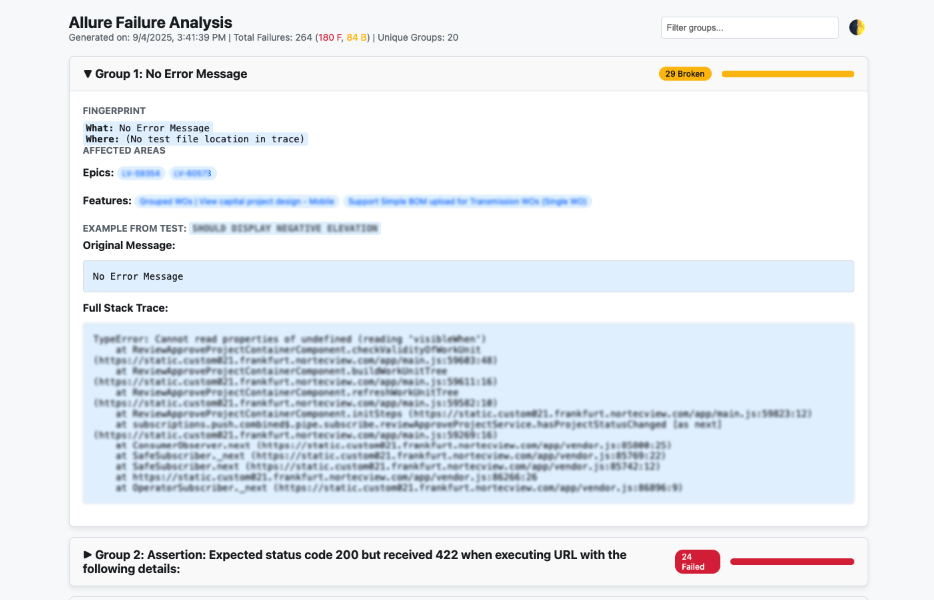

# Allure Failure Analyzer

> A fast, configurable CLI that scans **Allure** results, **groups failures by root cause**, and produces an easy‑to‑read **interactive HTML** (and JSON/Markdown) report.




---

## Table of Contents
- [Overview](#overview)
- [Key Features](#key-features)
- [Project Structure](#project-structure)
- [Prerequisites](#prerequisites)
- [Installation & Setup](#installation--setup)
- [Configuration](#configuration)
- [Usage](#usage)
- [How It Works](#how-it-works)
- [Notes & Tips](#notes--tips)
- [Troubleshooting](#troubleshooting)
- [FAQ](#faq)
- [License](#license)

---

## Overview
Running hundreds or thousands of automated tests can generate a massive amount of data. Sifting through failed tests to find the real, underlying issues is time‑consuming and inefficient. **This tool automates that process.**

It scans your `allure-results` directory, extracts detailed information about every single **failed** or **broken** step, and uses a smart *fingerprinting* algorithm to group similar failures together. The final output is a clean, filterable HTML dashboard (plus JSON/Markdown) that highlights your most critical issues so you can focus debugging where it matters most.

---

## Key Features
- **Deep Failure Analysis** — traverses results, containers, nested steps, and attachments.
- **Intelligent Grouping** — regex‑driven fingerprinting clusters failures by **cause**, not by test name.
- **Interactive HTML Report** — single, self‑contained page with:
  - Dark/Light mode
  - Live search & filters
  - Collapsible groups with rich examples
  - Progress bars for **Failed** vs **Broken**
- **Fast & Parallel** — parses thousands of JSON files using `ProcessPoolExecutor`.
- **Offline by Design** — never calls external services.
- **Config‑First** — behavior controlled by a simple `config.yaml`.
- **Friendly UX** — optional built‑in server to open the report locally.

> You can also rely on the Markdown summary if you prefer a lightweight artifact, or consume the JSON directly in custom dashboards.

---

## Project Structure
```text
allure-analyzer/
├── analyzer/
│   ├── __init__.py         # Makes 'analyzer' a Python package
│   ├── ingestion.py        # Fast, parallel data loading from Allure (results + containers + steps + attachments)
│   ├── fingerprinter.py    # Core logic for creating stable failure fingerprints
│   └── reporting.py        # Generates grouped data (JSON/MD) and supports the HTML dashboard
├── config.yaml             # Main configuration file (edit this)
├── main.py                 # Entrypoint: orchestrates ingestion → grouping → reporting
├── report.html             # Static, self-contained dashboard (reads the generated JSON)
└── requirements.txt        # Minimal dependencies (e.g., PyYAML)
```

---

## Prerequisites
- **Python** 3.8+ (3.11 recommended)
- **pip** (Python package installer)

---

## Installation & Setup
```bash
# 1) (Recommended) create and activate a virtual environment
python -m venv .venv
# macOS/Linux
source .venv/bin/activate
# Windows (PowerShell)
# .venv\Scripts\Activate.ps1

# 2) Install dependencies
pip install -r requirements.txt
```

---

## Configuration
Edit `config.yaml` in the project root:

```yaml
# Path to the Allure results directory generated after a test run.
# This is the most important setting.
allure_results_directory: './allure-results'

# The base name for the output report files.
# The tool will generate a .json, a .md and use 'report.html' as the UI.
output_report_file: 'failure_analysis_report.html'

# Number of top groups to include in summaries (0 or negative = show all).
top_n_groups_to_report: 20

# Used to locate the most relevant line in stack traces (first match wins).
# For TypeScript/JS projects, use a stable path segment from your codebase
# (e.g., 'src/', 'apps/web', 'packages/').
project_root_package: 'src/'
```

**Choosing `project_root_package` (TS/JS):**
- Pick a path segment unique to your code (e.g., `src/`, `apps/web`, `packages/`).
- Avoid strings that may appear in `node_modules`.
- If unsure, start with `src/` and refine later.

---

## Usage
```bash
# Run the analyzer from the project root
python main.py
```
What you get:
- `failure_analysis_report.json` — structured grouped data
- `failure_analysis_report.md` — concise Markdown summary
- `report.html` — interactive dashboard (reads the JSON)

To serve the HTML locally (optional):
```bash
python -m http.server
# Open http://localhost:8000/report.html
```

---

## How It Works
**1) Ingestion (`analyzer/ingestion.py`)**
- Scans `*-result.json` and correlates matching `*-container.json`
- Recursively walks nested steps and attachments
- Extracts `message`/`trace` from status details or attachments (text/JSON)
- Captures the **failing step name** and all step names
- Promotes `epic`/`feature` parameters into labels (for reporting)

**2) Fingerprinting (`analyzer/fingerprinter.py`)**
- Normalizes volatile tokens (UUIDs, long hex, numbers, IPs, emails, URLs, timestamps, paths)
- Collapses JIRA‑like keys: `ABCD-12345` → `ABCD-<NUM>`
- Picks the most stable key:
  1. failing step name
  2. message
  3. test fullName/name
- Resolves code location from stack; falls back to labels (package/testClass/testMethod/suite/subSuite)

**3) Reporting (`analyzer/reporting.py` + `report.html`)**
- Groups by fingerprint and sorts by frequency
- Aggregates affected **epics** and **features**
- Writes JSON & Markdown; the static HTML renders the JSON in the browser

---

## Notes & Tips
- Keep `allure_results_directory` on SSD for best performance.
- Ensure `project_root_package` points to your repo’s code path (e.g., `src/`) to improve stack matching.
- If your adapters store stacks inside JSON attachments under custom keys, extend the extraction rules in `ingestion.py`.

---

## Troubleshooting
- **Too many unique groups** — Messages may be empty; grouping will then depend on failing step names. Consider refining normalization or adding adapter‑specific extractors.
- **Code Location shows `(no trace)`** — Stacks might live in attachments. The ingestor reads containers and nested steps, but ensure your pipeline actually saves stack traces.
- **No files found** — Verify `allure_results_directory` and that it contains `*-result.json` files.

---

## FAQ
**Q: Does it call external services?**  
A: No. The tool is completely offline.

**Q: Can I customize fingerprinting?**  
A: Yes. Edit `analyzer/fingerprinter.py` to adjust normalization and key selection.

**Q: Is it suitable for TypeScript/Playwright/Cypress?**  
A: Yes. It extracts stacks from text/JSON attachments and falls back to labels/steps when stacks are absent.

---

## License
[MIT](https://github.com/keinar/AI-Bug-Reporter/blob/main/LICENSE)
