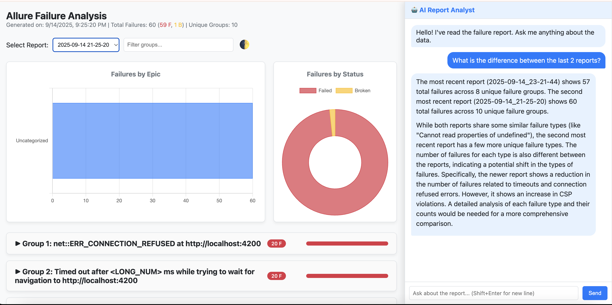

# Allure AI Failure Analyzer

> An intelligent CLI tool that transforms raw Allure test results into an interactive dashboard featuring a powerful AI analyst. Get visual insights, proactive summaries, and ask complex questions about your test failures in natural language.



---
## Table of Contents
- [Features](#features)
- [Project Structure](#project-structure)
- [Prerequisites](#prerequisites)
- [Installation & Setup](#installation--setup)
- [Configuration](#configuration)
- [Usage](#usage)
- [How It Works](#how-it-works)
- [Using the AI Analyst](#using-the-ai-analyst)
- [License](#license)

---
## Features

✨ **Interactive HTML Dashboard:** Clearly displays grouped failures with expandable details, including stack traces and examples.

🤖 **Integrated AI Analyst (Powered by Gemini):**
- **Conversational Memory:** Engage in a stateful conversation. The AI remembers the context of previous messages for follow-up questions.
- **Autonomous Tool Use:** The AI agent proactively uses a toolbox of functions to access historical data, analyze trends, and answer complex questions.
- **Natural Language Understanding:** Ask complex questions like "What's the difference between the last two reports?" or "What was the most common error this week?"

🚀 **Proactive Executive Summary:** On report load, the AI automatically analyzes the latest run and provides a summary of key insights directly in the chat. (This can be disabled in `config.yaml`).

📊 **Visual Data Dashboard:**
- Get immediate visual insights into your test data.
- **Failures by Epic Chart:** A bar chart showing the total number of failures categorized by their associated 'epic' label.
- **Status Breakdown Chart:** A doughnut chart visualizing the ratio of 'failed' vs. 'broken' tests.

📈 **Historical Trend Analysis:**
- The AI can analyze the entire report history to identify patterns.
- Ask about failure trends, the recurrence of specific bugs, and the impact of fixes over time.

---
## Project Structure

```text
allure-analyzer/
├── analyzer/
│   ├── __init__.py
│   ├── ingestion.py
│   ├── fingerprinter.py
│   └── reporting.py
├── static/
│   ├── style.css
│   └── main.js
├── reports_history/
│   └── (Generated report folders will appear here)
├── .env.example
├── config.yaml
├── main.py
├── report.html
├── requirements.txt
└── server.py 
```

---
## Prerequisites
- **Python 3.11+**
- **pip** (Python package manager)
- An **Allure results** directory generated from a test run.

---
## Installation & Setup

1.  **Clone the Repository:**
    ```bash
    git clone <your-repository-url>
    cd allure-analyzer
    ```

2.  **Create and Activate a Virtual Environment (Recommended):**
    Ensure you are using Python 3.11 or newer.
    ```bash
    python3.11 -m venv .venv
    source .venv/bin/activate
    ```
    *For Windows, use `.venv\Scripts\activate`*

3.  **Install Dependencies:**
    ```bash
    pip install -r requirements.txt
    ```

4.  **Set Up Your API Key:**
    - Create a new file named `.env` in the project root.
    - Copy the content from `.env.example`.
    - Replace the placeholder with your actual Gemini API key from Google AI Studio.
    ```
    GEMINI_API_KEY="your-api-key-here"
    ```

---
## Configuration
You can customize the tool's behavior via the `config.yaml` file:

```yaml
# Path to the Allure results directory.
allure_results_directory: './allure-results'

# Name of the output HTML report file.
output_report_file: 'failure_analysis_report.html'

# Number of top failure groups to include in the report. -1 means all groups.
top_n_groups_to_report: -1

# Include broken tests (status='broken') in the analysis.
include_broken: true

# --- UI Behavior ---
# Set to true to automatically get an AI executive summary when the report loads.
proactive_summary_on_load: true

---
## Usage
Running the entire analysis and visualization pipeline is a single command:

```bash
python main.py
```

**What Happens:**
1.  The script analyzes the failures in your `allure-results` directory.
2.  It generates a new, timestamped report in the `reports_history` folder.
3.  It starts the local Flask web server.
4.  It automatically opens the interactive report in your default web browser at `http://localhost:8000`.

---
## How It Works

- **Backend (Python/Flask):** The `main.py` script acts as the entry point, running the analysis and then launching the web server from `server.py`. The `server.py` file is the core of the application, serving the frontend and acting as a controller for the AI agent.

- **AI Agent:** The server manages a stateful chat session. It provides the Gemini model with a "toolbox" of Python functions. The AI autonomously decides which tools to use (e.g., `get_list_of_all_reports`, `analyze_failure_trends`) to gather the necessary data before formulating its answer.

- **Frontend (HTML/JS):** The `report.html` file is a single-page application. The JavaScript in `static/main.js` fetches data from the backend, renders the failure groups, draws the charts using `Chart.js`, and manages the interactive chat with the AI analyst.

---
## Using the AI Analyst
The AI analyst is designed to understand natural language questions about your test reports. Here are some examples of what you can ask:

- **Simple Comparisons:**
  - "What is the difference between the last two reports?"
  - "Compare the current run to the one from `2025-09-14 21:25:20`."

- **Trend Analysis:**
  - "Analyze failure trends for the last 30 days."
  - "Is the 'Database connection timeout' failure getting better or worse over time?"
  - "What are the most persistent errors over the last week?"

- **Deep Dives:**
  - "What was the most impacted epic in the latest run?"
  - "Read the latest report and summarize the key issues for me."
  - "Are there any new, high-frequency failures that appeared in the last 3 days?"

---
## License
[MIT](LICENSE)